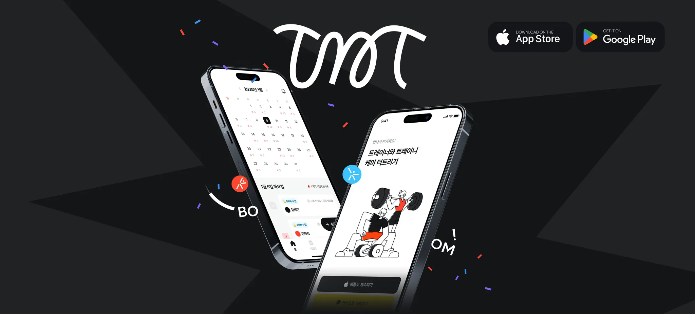
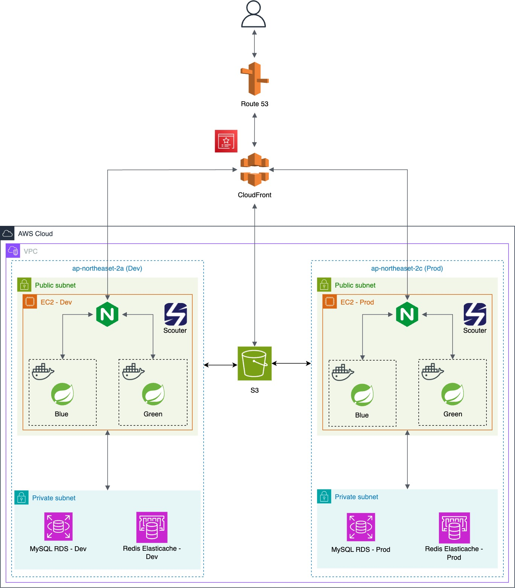

# TnT - 트레이너와 회원의 PT 관리 BE

- - -

  

## 앱 다운로드

  
 
  

## 서비스 소개

  

### **🧨** Problem: 각자의 문제는 다르지만 목표는 같은 우리, 트레이너와 트레이니 모두 효과적으로 PT를 지속할 수는 없을까? 🤨

| 🏋🏻 **트레이너(Trainer)** | 🏃🏻‍♂️ **트레이니(Trainee)** |
|------------------------|---------------------------|
| 많은 수의 회원을 관리하기 어려움     | 수업 외에 PT를 지속하기 힘듦         |
| 일정 정리의 번거로움            | 트레이너와 피드백 교환 과정이 번거로움     |

트레이너는 회원 개개인의 운동 진행 상황을 체계적으로 관리하기 어렵고, 효과적인 피드백을 제공하는 과정이 비효율적입니다.

반면, 트레이니는 수업 외에도 지속적인 운동 및 식단 관리를 원하지만 트레이너와의 원활한 소통이 쉽지 않아 PT 효과가 반감되는 경우가 많습니다.

트레이너와 트레이니 간의 **소통과 공유가 원활하지 않을수록, PT의 지속성과 효과는 점점 떨어질** 수밖에 없습니다. 😨

### **🧨** Solution:

> 💥 **트레이너와 트레이니의 상생 효과로 PT의 효능을 올려주는 서비스**

**트레이너**를 위해선 **PT 수업의 스케줄 및 회원 관리**, **트레이니**를 위해선 **수업 및 기록 관리**가 결합된 서비스가 필요합니다.
각 역할의 니즈에 맞게 PT 효과를 극대화하고자 트레이너와 트레이니, 두 가지 플로우를 다르게 개발하여 맞춤형 PT 관리 앱 서비스를 제공합니다.

| 🏋🏻‍♂️ **트레이너(Trainer)** | 🏋🏻‍♀️ **트레이니(Trainee)** |
|---------------------------|---------------------------|
| 회원 관리 효율화 및 일정 관리         | 기록 관리로 지속 가능한 운동 습관 형성    |

**우리는 트레이니도 쓰기 쉬운 트레이너 중심의 앱을 제공합니다.**

## AWS 아키텍처

## 기술 스택

| Category       | Stack                                                                                                                                                                                                                                                                                                                                                                                                                                                                                                                                           |
|----------------|-------------------------------------------------------------------------------------------------------------------------------------------------------------------------------------------------------------------------------------------------------------------------------------------------------------------------------------------------------------------------------------------------------------------------------------------------------------------------------------------------------------------------------------------------|
| **Language**   |                                                                                                                                                                                                                                                                                                                                                                                                                                            |
| **Build Tool** |                                                                                                                                                                                                                                                                                                                                                                                                                                            |
| **Framework**  |                                                                                                                                                     |
| **Library**    |                                                                                                                                                                                                                                                                                                                                   |
| **Database**   |                                                                                                                                                                                                                                                                                                                                             |
| **CI/CD**      |      _(현재 구성 중)_ |
| **API Docs**   |                                                                                                                                                                                                                                                                                                                                    |
| **Cloud**      |                                                                                                                                                                                                                                                                                                                                                                                                                                               |
| **Push Alarm** |                                                                                                                                                                                                                                                                                                                                                                                                                                             |                                                                                                                                                                                                                                                                                                                                                                                                                                                                      |
| **Logger**     |                                                                                                                                                                                                                                                                                                                                                                                                                                                                        |
| **APM**        |                                                                                                                                                                                                                                                                                                                                                                                                                                                                      |

## Backend Team 소개

|                                                    백엔드 개발                                                     |                                                       백엔드 개발                                                        |
|:-------------------------------------------------------------------------------------------------------------:|:-------------------------------------------------------------------------------------------------------------------:|
| <a href="https://github.com/ymkim97"> | <a href="https://github.com/fakerdeft"> |
|                                                      김영명                                                      |                                                         조만제                                                         |
